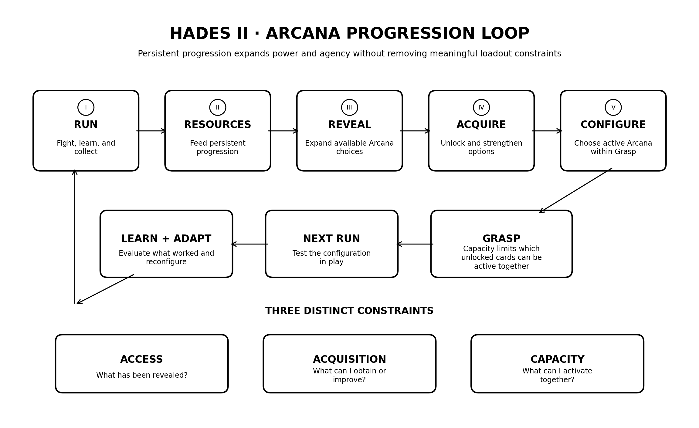

# Progression & Player Agency Hades II Study
A product teardown of how Hades II uses progression, resource constraints, and player agency to keep repeated runs meaningful.

## The question

Hades II is built around repetition.

A run ends. Much of the power accumulated during that run disappears. The player returns to the Crossroads and starts again.

But starting again doesn't mean returning to the same state.

That led me to a question:

> **How does Hades II make persistent progression feel rewarding without removing the constraints that make individual runs interesting?**

This study focuses primarily on Arcana and Grasp, with the broader progression economy as context.

### A note on perspective

My understanding of the game comes from both playing and observation.

I played on an already-progressed save after another player had completed the main game, so my own experience does not represent the intended fresh-save progression curve.

I also spent significant time watching that progression happen through another player's playthrough.

I use those experiences here to generate questions and observations, then separate them from documented game mechanics.

---

## Progress exists in more than one place

The most obvious progression happens during a run.

A player chooses a weapon, encounters gods, selects Boons and other upgrades, develops a build, and attempts increasingly difficult encounters.

Much of that resets.

But other forms of progression don't.

### Run progression

> encounter → reward → stronger build → harder encounter → boss → reset

### Persistent progression

> run → resources → unlock or strengthen systems → future runs change

### Player progression

There is also progression the game doesn't need to store.

The player learns.

Which weapons fit their playstyle?

Which Boons work well together?

What does a boss telegraph before a particular attack?

How far can this build realistically go?

A failed run can therefore still produce value even when its temporary power disappears.

---

## Randomness creates the problem. Agency makes it interesting.

Early in my experience with Hades II, part of the appeal was discovering what different Boons did and learning which combinations worked.

Those Boons aren't guaranteed on the next run.

That uncertainty matters.

If a player could simply select an exact weapon, god and Boon configuration before every attempt, a solved build could be reproduced repeatedly.

The game would become substantially more deterministic.

But complete randomness creates the opposite problem: player knowledge would have limited value if there were no way to act on it.

Hades II gradually gives the player tools to influence future runs without completely controlling them.

Keepsakes are one example.

Once I know that I like a particular god's Boons with a particular playstyle, an Olympian Keepsake lets me deliberately steer a future run toward that god when a Boon opportunity appears.

I still don't control the rest of the build.

That distinction became important:

> **Agency doesn't require certainty.**

The player can make increasingly informed decisions while the game preserves enough uncertainty to require adaptation.

---

## Why not use one permanent currency?

Hades II could have a much simpler persistent economy.

Complete encounters. Earn one currency. Spend it on weapons, Arcana, upgrades and everything else.

That would also create a very different progression system.

A universal currency makes it easier for players to identify an efficient earning path and direct everything toward the upgrades they already know they want.

Instead, Hades II uses differentiated resources that feed different progression systems.

Within Arcana alone, resources perform different jobs:

**Ashes** are primarily used to unlock revealed Arcana cards.

**Psyche** expands Grasp capacity.

**Moon Dust and other materials** strengthen Arcana.

Other resources feed weapons, Incantations, relationships and other persistent systems.

The economy therefore doesn't only determine how quickly a player becomes stronger.

It can also influence **where the player goes, what they interact with, and which systems they discover along the way.**

That makes resources part of the progression design rather than simply prices attached to upgrades.

---

## Arcana as a progression system

Arcana became the most useful system to examine because it separates several forms of progression that could easily have been collapsed into one.

The player does not simply:

> earn currency → buy permanent stat → become stronger

Instead, progression includes revealing choices, acquiring them, increasing capacity and deciding what to activate.

**Arcana progression system map**  
Persistent progression expands player power and agency while preserving constraints on what can be used simultaneously.

---

## Three different constraints

Looking at Arcana as a product system exposed three distinct constraints.

### Access

**What has been revealed?**

The Arcana board does not expose every option immediately. Progress through the board reveals adjacent cards.

This controls when choices enter the player's decision space.

### Acquisition

**What can I obtain or improve?**

Revealing an option does not automatically give it to the player.

Resources determine which available options can actually be unlocked or strengthened.

### Capacity

**What can I activate together?**

Owning an Arcana card does not mean it can always be active.

Grasp creates a capacity constraint across the loadout.

### Why the distinction matters

These constraints solve different problems.

**Access** controls the expansion of choice.

**Acquisition** gives resources value and creates prioritization.

**Capacity** preserves tradeoffs after the player has already earned the options.

---

## More choice isn't automatically better choice

The Arcana reveal structure initially looked like another restriction.

Why not show every card immediately and let players decide what they want?

Because the number of available decisions isn't the same as the number of meaningful decisions.

A new player is simultaneously learning combat, weapons, Magick, Omega moves, Casts, gods, Boons, resources, routes and bosses.

Giving that player every Arcana option immediately would technically provide more choice.

It would not necessarily provide more **informed** choice.

Instead, the decision space expands as the player gains more context for understanding those decisions.

Progression therefore isn't only:

> weak → strong

It can also be:

> **few decisions → understandable decisions → more sophisticated decisions**

The adjacency system controls the sequence in which player choice expands.

---

## Progression should loosen constraints without necessarily eliminating them

Grasp creates another tension.

Increasing Grasp is rewarding because the player can activate more powerful combinations.

If the constraint never meaningfully loosened, progression could feel artificial.

But if progression eventually allowed every desirable Arcana card to remain active simultaneously, configuration would stop requiring meaningful tradeoffs.

Hades II sits between those extremes.

Progression increases what the player can do without completely removing the capacity constraint.

That led to another useful principle:

> **Progression can relax a constraint without eliminating the thing that made the constraint meaningful.**

The reward is greater freedom.

The system still asks the player to choose.

---

## Economy health isn't just a spreadsheet problem

Thinking through Arcana also changed how I approached economy balancing questions.

Suppose players obtain an important upgrade substantially faster than expected.

The obvious response might be:

> Increase the cost.

But "faster than expected" isn't itself the product problem.

Before changing the economy, I would want to know:

- Why was the original acquisition speed important?
- Is this upgrade meaningfully affecting player power?
- What downstream systems change when players receive it earlier?
- Does it alter boss difficulty or progression pacing?
- Does it reduce the value of later rewards?
- Is the problem actually the cost, or is the resource source too generous?
- Is there evidence that the current pacing is producing a worse player experience?

The same applies to resource surplus.

Players finishing with large amounts of unused currency could indicate a source/sink imbalance.

It could also mean players don't value the remaining sinks.

Or the surplus may have no meaningful negative effect at all.

> **An economy observation is not automatically an economy problem.**

The impact has to be understood before the number is tuned.

---

## Incentivized behavior isn't automatically valuable behavior

Resources also create behavior.

If an important upgrade requires a particular resource, players have a reason to engage with the activity that produces it.

Telemetry might show repeated engagement with that activity.

That doesn't establish that players enjoy it.

I would want to understand the counterfactual:

> **Would players still choose this activity if the economy weren't requiring them to do it?**

Useful signals could include whether players return after they no longer need the resource, which source they choose when multiple acquisition paths exist, where progression drop-off occurs, and what players say about why they engage with the activity.

A progression system can successfully incentivize behavior without necessarily making that behavior valuable to the player.

---

## What if everyone eventually makes the same choice?

A final systems question comes from Arcana's capacity constraint.

Imagine telemetry showed that 80% of late-game players eventually converged on essentially the same Arcana configuration.

My first reaction would be that something may be wrong.

But convergence doesn't identify the cause.

I would investigate several possibilities:

**Balance**

Are particular cards simply too strong relative to their Grasp cost?

**Alternatives**

Do other cards produce effects meaningful enough to justify their opportunity cost?

**Synergy**

Does one Arcana configuration work unusually well across many weapons and Boon combinations?

**System influence**

Is persistent Arcana power determining run success more than run-level weapons, Boons and adaptation?

**Encounter design**

Does late-game content disproportionately reward the same capabilities?

**Player meta**

Are players independently discovering the same dominant configuration, or following guides even when other configurations remain viable?

The important question isn't simply:

> What should we nerf?

It's:

> **Why is this strategy dominant, what downstream behavior does that dominance create, and is that behavior actually harmful to the intended experience?**

Convergence is a signal to investigate, not proof of what should change.

---

## What I learned

I started this study thinking primarily about why repeated runs still felt worthwhile.

The more interesting system turned out to be the relationship between **progression and constraint**.

Hades II repeatedly gives the player more:

- power
- knowledge
- options
- control

without giving them complete control over the run.

Boons preserve uncertainty.

Keepsakes let knowledge influence that uncertainty.

Resources pace access to persistent systems.

Arcana expands persistent power and choice.

Grasp prevents ownership from eliminating configuration tradeoffs.

The pattern I kept finding was:

> **Progression becomes meaningful not because constraints disappear, but because the player gains increasingly informed ways to operate within them.**

That is what makes the Arcana system interesting to me as a product system rather than simply a collection of upgrades.

---

## Scope

This is a focused product teardown, not a complete analysis of the Hades II economy.

I deliberately centered Arcana and Grasp rather than attempting to document every resource, weapon, Boon, Incantation, relationship system or progression mechanic in the game.

The goal was to understand one interconnected system deeply enough to reason about its constraints, economy and downstream player behavior.

---

## Research

- [Product reasoning log](research/reasoning-log.md) — Observations, evolving hypotheses, rejected assumptions, and the reasoning behind the analysis.
